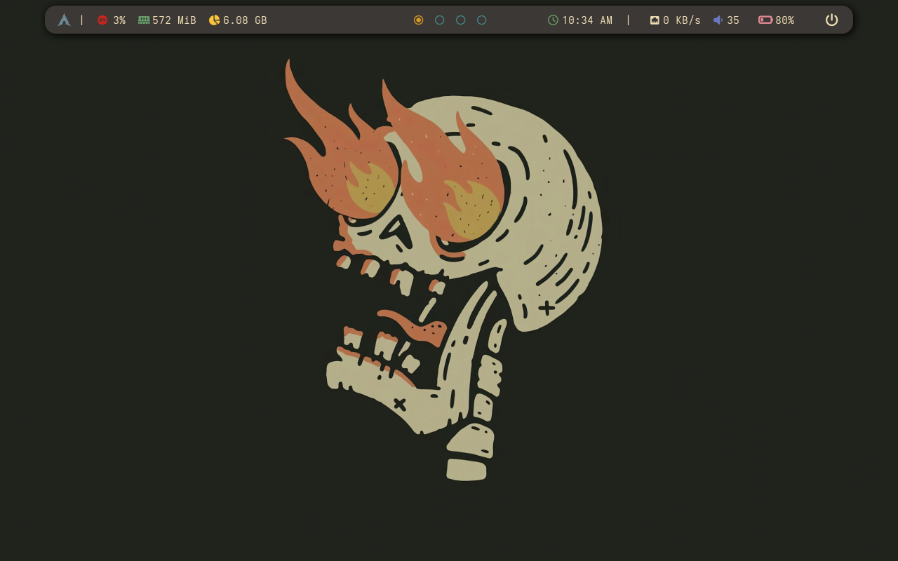
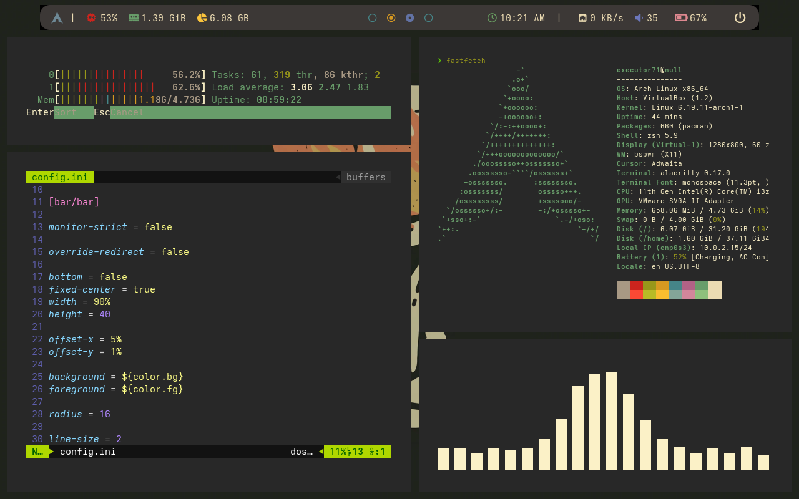
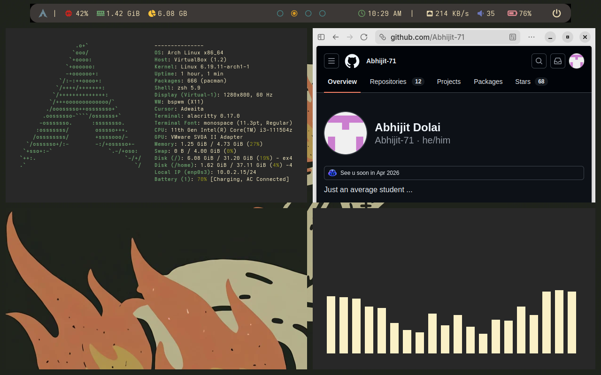
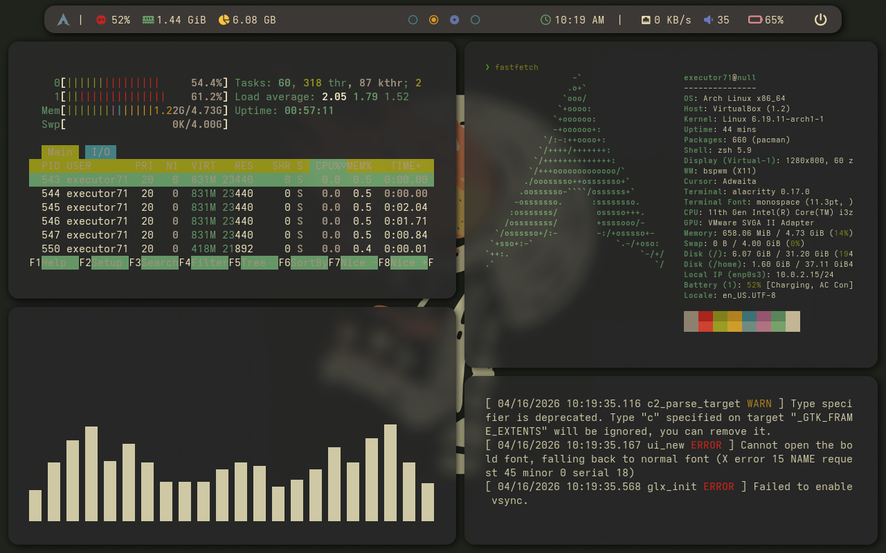

# Dotfiles
Dotfiles for rofi, polybar, alacritty and picom. Just copy and paste to get a sleek minimal window manager.
The configs are primarily made in bspwm but works on all linux distribution and all window managers with mentioned programs , best for x11 based wm.

---

## 📸 Demo

Here’s a preview of the setup in action:







Picom enabled -



---

## ⚙️ Installation Guide

### 1. Clone the repository

```diff
- Do re-check all commands before running , dont copy paste.
```
```diff
+ Nerdfonts are must , for icon/gylph support , use any nerd font.
set it up , in configs : by checking all nerd fonts in your system and adding your desired
font to config. Many tutorials out there on internet. 
```


Change dir to home then run commands --
```bash
cd ~
git clone https://github.com/yourusername/dotfiles.git
```
After clonig the repo , delete all .png files and readme file as it is of no use ; You can keep it if you want. 

Now if you are on *bspwm* just these -
```bash
mv .config .config-backup
mv config .config
```
If not on _bspwm_ , just copy the config files of the apps you want and paste in your config directory typically -
```bash
cd ~/.config && ls
```
Now replace dir of your installed programs with dir from this repo : if want to change picom -
```
cd ~
mv config/picom .config/picom
```
Refer to the directory struct. give below and the programss wiki/manual for more info.
And all set , enjoy your riced setup .... 

---

## 📦 Programs

- [Alacritty](https://man.archlinux.org/man/alacritty.1.en) — Terminal emulator
- [Polybar](https://man.archlinux.org/man/polybar.1.en) — Status bar
- [Rofi](https://man.archlinux.org/man/rofi.1.en) — Application launcher / menu
- [sxhkd](https://man.archlinux.org/man/sxhkd.1.en) — Hotkeys configuration daemon
- [Picom](https://man.archlinux.org/man/picom.1.en) — Compositor for X11
- [bspwm](https://man.archlinux.org/man/bspwm.1.en) — Tiling window manager

---

## 📂 Directory Structure
```
dotfiles/
├── config
│   ├── alacritty
│   ├── bspwm
│   ├── picom
│   ├── rofi
│   ├── sxhkd
│   └── polybar
├── arch-br-normal.png
├── arch-picom-bg.png
├── arch-picom.png
├── arch-vim-normal.png
└── README.md
```

---

##  Acknowledgements

Inspired from - 
- [f3l3p1n0](https://github.com/f3l3p1n0/skullsage)
- [felipevcc](https://github.com/felipevcc/dotfiles)

with few tweaks...

Thanks for checking out my dotfiles!  
Feel free to fork, tweak, and share improvements.

